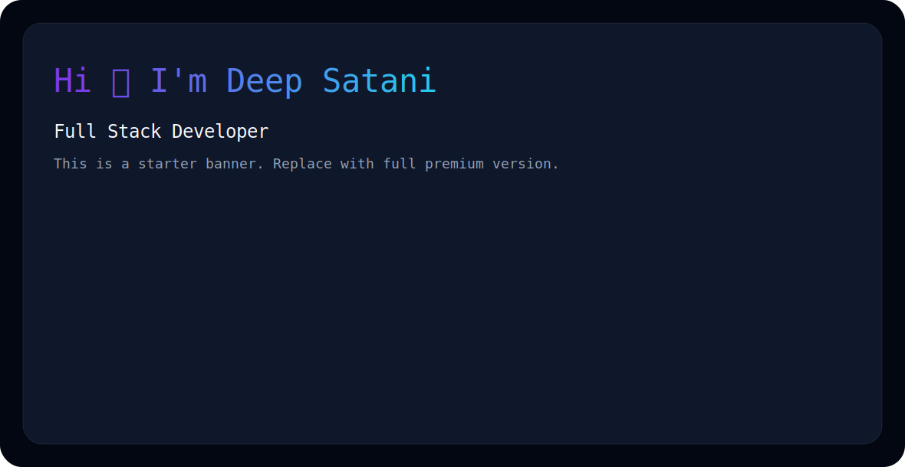

<picture>
  <source media="(prefers-color-scheme: dark)" srcset="./assets/dark.svg">
  <source media="(prefers-color-scheme: light)" srcset="./assets/light.svg">
  
</picture>

# Hi 👋 I'm Deep Satani

### Full Stack Developer

💻 Passionate about ASP.NET MVC, C#, SQL Server, React & Node.js

📍 Rajkot, Gujarat, India

